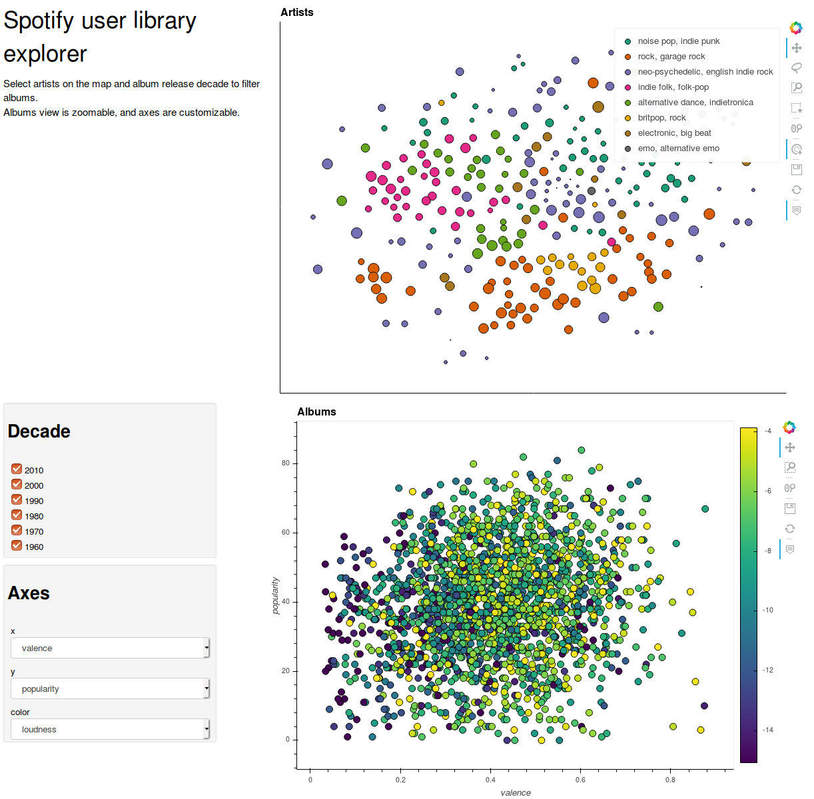
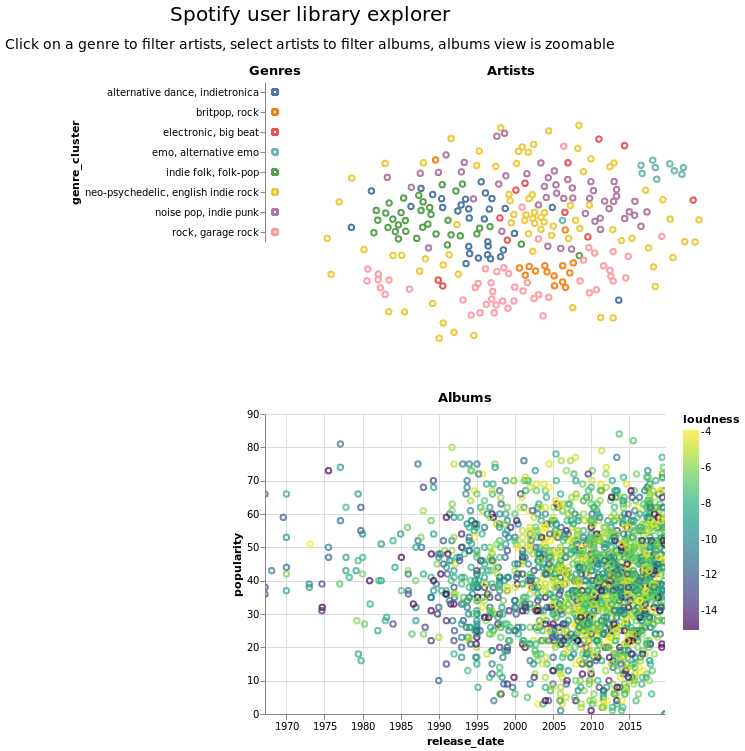

# Spotify Dashboards

Building dashboards using Spotify user library data.

Notebook 0 is used to fetch data from a Spotify account, build clean datasets, and add interesting features (such as artists genres clustering). Data in the `data/` directory was generated with this notebook using my Spotify account.

Notebook 1 builds an interactive dashboard with [Bokeh](https://bokeh.pydata.org/en/latest/), [Holoviews](http://holoviews.org/) and [Panel](https://panel.pyviz.org/index.html). It can be run with binder [here](https://mybinder.org/v2/gh/theodcr/spotify-dashboards/master?urlpath=/proxy/5006/1_panel_bokeh_dashboard).

Notebook 2 builds a simpler interactive dashboard with [Altair](https://altair-viz.github.io/). It creates a stand-alone [Vega](https://vega.github.io/vega/) HTML visualization, with all interactivity embedded, that can be viewed [here](https://theodcr.github.io/spotify-dashboards/index.html).

Screenshots:

